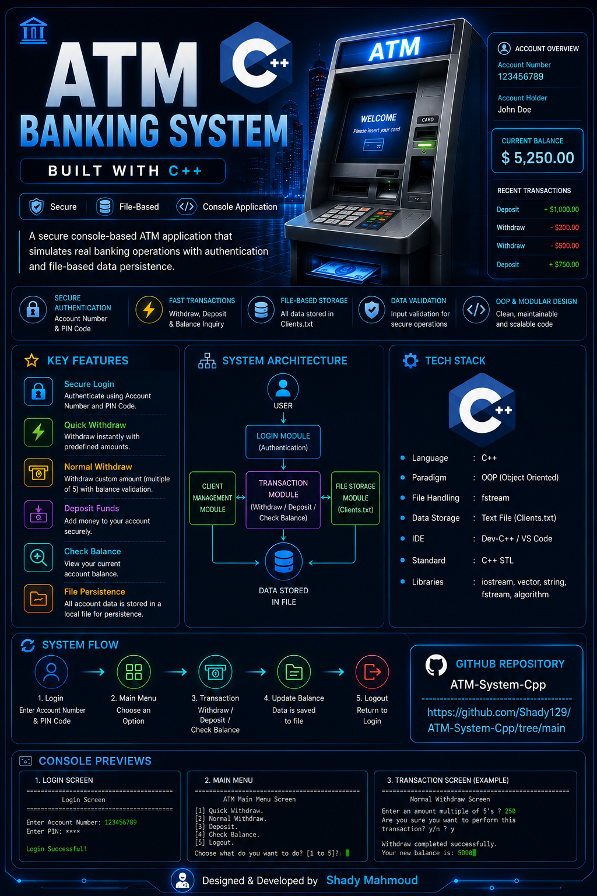

# 🏧 ATM System – C++ Console Application

  

A C++ console-based ATM system that simulates real-world ATM operations with a strong focus on clean code, file handling, and structured programming. The project demonstrates how a complete banking workflow can be implemented using basic C++ concepts without external libraries or databases.

## 🚀 Features
- 🔐 Login system with three-attempts protection
- 💸 Quick withdraw with predefined amounts
- 💵 Normal withdraw with custom amount
- ➕ Deposit money
- 📊 Check account balance
- 🔁 Logout and re-login
- 💾 Persistent data storage using text files

## 🛠️ Technologies Used
- C++
- STL (vector, string)
- File handling using fstream
- Console application

## 📂 Project Structure
ATM-System-Cpp/
├── ATM.cpp  
├── Clients.txt  
├── README.md  
└── .gitignore  

## 💾 Data Storage
All client data is stored in a text file called Clients.txt. Each line represents one client using the following format:

AccountNumber#//#PinCode#//#Name#//#Phone#//#Balance

## 🧠 Project Design Overview
The system uses a global session object to represent the currently logged-in client. File operations are separated from business logic to keep the code clean and readable. Balance updates are handled through a single centralized function to avoid duplicated logic. Menu navigation is implemented using enums for better clarity and control flow. The overall application flow is structured, predictable, and easy to follow.

## 🧹 Code Quality
This project applies clean code principles such as avoiding duplicated logic, keeping each function responsible for a single task, using clear naming conventions, centralizing file updates, and maintaining a controlled and maintainable program flow.

## ▶️ How to Run
1. Clone the repository:
git clone https://github.com/Shady129/ATM-System-Cpp.git
2. Open the project in Visual Studio.
3. Make sure Clients.txt is located in the same directory as the executable.
4. Build the project.
5. Run the application.

## 👤 Sample Login Data
You can test the system using the following sample data inside Clients.txt:

1001#//#1234#//#Ahmed Ali#//#0100000000#//#5000  
1002#//#1111#//#Mohamed Salah#//#0111111111#//#8000  

## 🎯 Learning Outcomes
- Understanding how to work with text files as a simple database
- Building a complete console-based system from scratch
- Applying clean code principles in a real project
- Using enums to control menus and user choices
- Managing application flow and user session state
- Debugging real file-handling issues in C++

## 🚀 Future Improvements
- Transfer between accounts
- Change PIN functionality
- Better input validation
- Convert the project to a full OOP design
- Use binary files instead of text files

## 📝 Learning Notes
This project highlights common real-world issues when working with files in C++, such as working directory confusion, relative vs absolute paths, hidden file extensions (e.g. .txt.txt), file opening failures, and debugging techniques. These challenges were intentionally encountered and resolved as part of the learning process.
